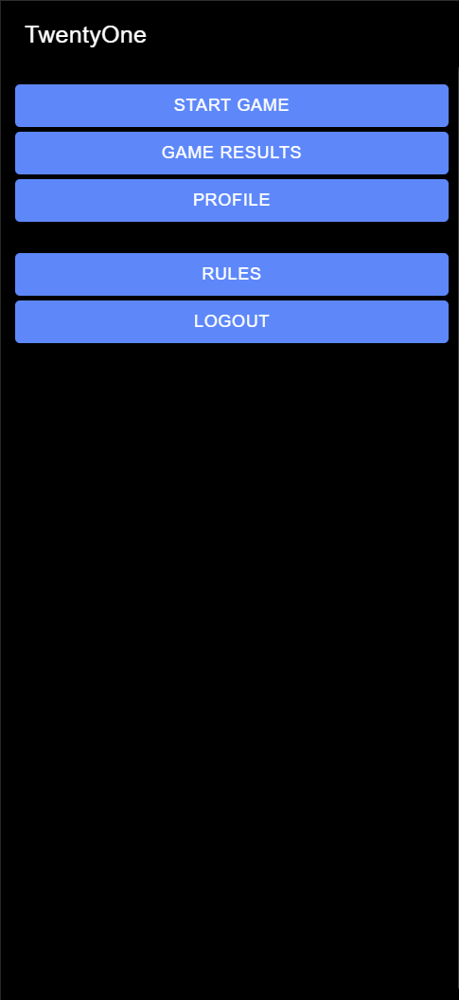
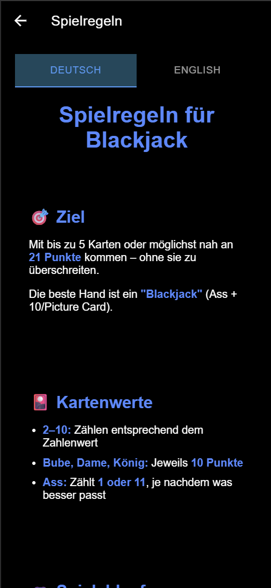
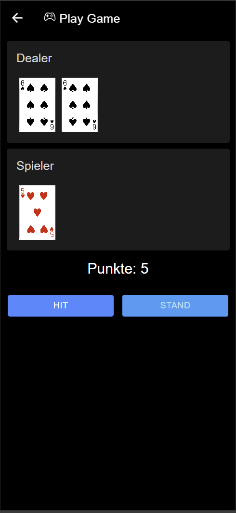
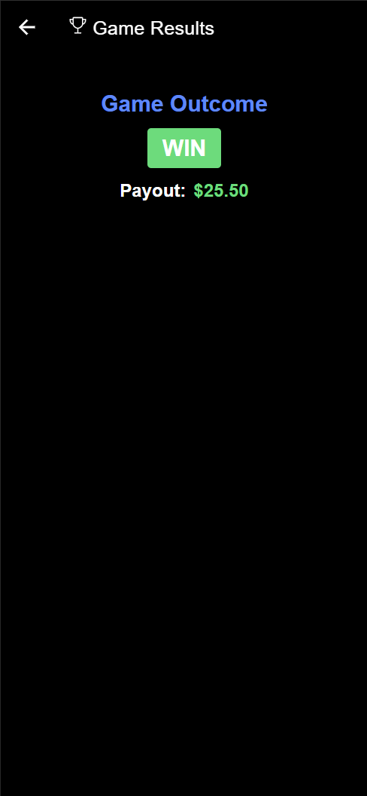

## 🎯 Implemented User Stories for Milestone 2

### User Story 1 – Static Page

**As** an interested visitor  
**I want** to read the rules of Blackjack and how the app works,  
**so that** I can understand the game before I start playing.

**Affected Resources:**  
_None_

**Planned Implementation:**  
Homepage with a static explanation of game rules, visual illustrations, and a start button.

**Screenshot**

***Start Screen***

***Rules***

---

### User Story 2 – View Game Status (GET)

**As** a player  
**I want** to view the current state of the game,  
**so that** I can see my cards, the dealer’s visible card, and my total.

(The flow of the game is going to be implemented in Milestone3 User Story 5 & 6)

**Affected Resources:**
- `game-session`
- `card`

**Planned Implementation:**  
`GET /game-sessions/{id}`  
→ Displays the current hand (player & dealer), totals, and game phase.

**Screenshot**

***Play Game***

---

### User Story 3 – View Game Result (GET with Relationship)

**As** a player  
**I want** to see the game result after a game session ended,  
**so that** I know the outcome of a session.

**Affected Resources:**
- `game-result`
- `game-session`

**Planned Implementation:**  
`GET /game-sessions/{id}/game-results`  
→ Displays the outcome of a game session.

**Screenshot**

***Game Result***

---
